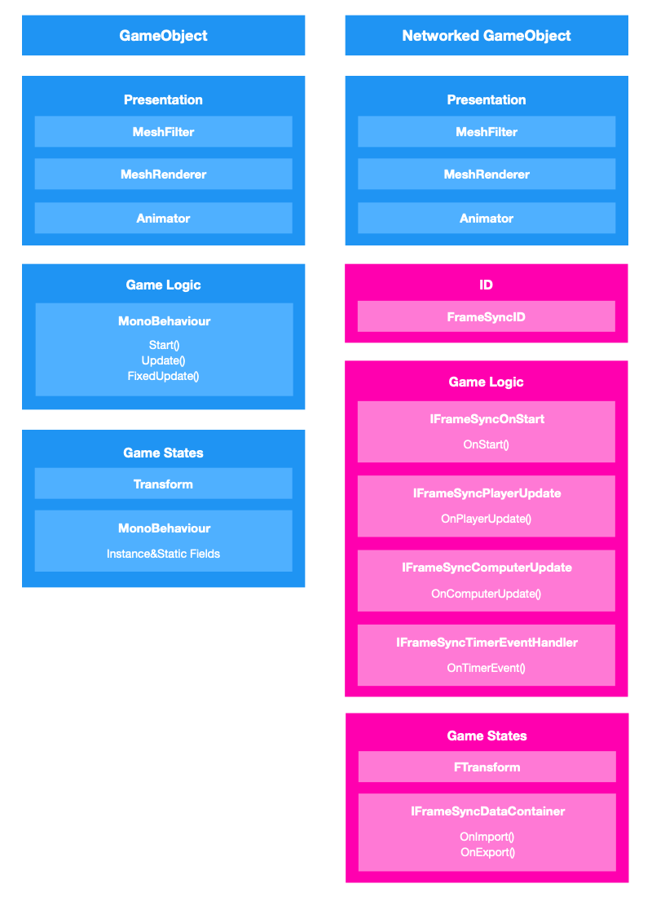

# **Networked GameObject**

{: width=800 }

## **Seperation of Game Logic And Presentation**
Your game logic should only be implemented in the IFrameSync interfaces. All the Unity MonoBehaviour [events/messages][1] are considered indeterministic, you should use them for presentation purpose only.

| **Deterministic**       |        **Description**          |
| ----------- | ------------------------------------ |
| [IFrameSyncOnStart][2]       |  Called before the first [IFrameSyncPlayerUpdate][3] and [IFrameSyncComputerUpdate][4] . Implement this interface to initialzie the component.  |
| [IFrameSyncPlayerUpdate][3]       |  Called by the `FrameSyncEngine` to update the player owned `FrameSyncBehaviour` during frame simulation.  |
| [IFrameSyncComputerUpdate][4]       |  Called by the `FrameSyncEngine` to update the computer owned `FrameSyncBehaviour` during frame simulation.  |
| [IFrameSyncTimerEventHandler][5]       |  Called when a `FrameSyncTimer` event occurs.  |

| **Indeterministic**       |        **Description**          |
| ----------- | ------------------------------------ |
| Start      |  called when the GameObject begins to exist (either when the Scene is loaded, or the GameObject is instantiated).  |
| Update      |  called every frame.  |
| FixedUpdate     |  called every physics timestep.  |
| OnCollisionEnter and OnTriggerEnter   |  called when physics collisions or triggers occur.  |

[1]: https://docs.unity3d.com/Manual/class-MonoBehaviour.html
[2]: IFrameSyncOnStart.md
[3]: IFrameSyncPlayerUpdate.md
[4]: IFrameSyncComputerUpdate.md
[5]: IFrameSyncTimerEventHandler.md
[6]: ../InputSettings.md