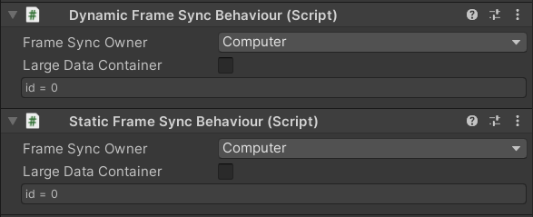

# **FrameSyncBehaviours**

The `FrameSyncBehaviour` class derives from `MonoBehaviour`. It acts as the unique identifier of a GameObject. All of the networked GameObjects should have a `FrameSyncBehaviour` component. 

!!! info

    To create game logic, implement [IFrameSyncStart][1], [IFrameSyncPlayerUpdate][2], [IFrameSyncComputerUpdate][3], and [IFrameSyncDataContainer][3] interfaces in your `MonoBehaviour` scripts and attach them to your GameObjects.

{: width=512 }

## **StaticFrameSyncBehaviours**
Designed for GameObjects that are **not** dynamically instantiated or destroyed. If a GameObject is instantiated or destroyed at runtime, `DynamicFrameSyncBehaviour` should be used.

## **DynamicFrameSyncBehaviours**
Designed for GameObjects that are dynamically instantiated or destroyed.

???+ info

    `DynamicFrameSyncBehaviour` components will be automatically added to the GameObjects created at runtime.
    
    You don't need to add it to your prefabs.

## **Properties**

| **Name**       | **Function**                          |
| ----------- | ------------------------------------ |
| Frame Sync Owner     |  The owner of the `FrameSyncBehaviour`. For `StaticFrameSyncBehaviour`, its owner should be set in the editor. For `DynamicFrameSyncBehaviour`, it's owner is set on creation.  |
| Large Data Container       |  By default, a `FrameSyncBehaviour` can contain up to 256 bytes of data. If `Large Data Container` is enabled, the limit is increased to 4096 bytes.  |
| id      |  The UInt32 unique identifier of the GameObject. The property is for debug purpose and is readonly.  |

[1]: GameLogic/IFrameSyncStart.md
[2]: GameLogic/IFrameSyncPlayerUpdate.md
[3]: GameLogic/IFrameSyncComputerUpdate.md
[4]: GameLogic/IFrameSyncDataContainer.md