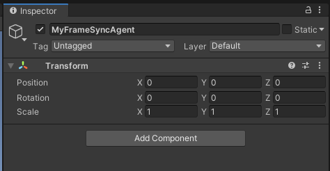

# Creating FrameSyncAgent 

You will create an empty GameObject to house your customized [FrameSyncAgent][1]. 

{: width=720 }

## MyFrameSyncAgent

Next, create a new script `MyFrameSyncAgent` and attach it to the empty GameObject by selecting **Add Componnet**. 

Remove the `Start()` and `Update()` methods and add the following to the `MyFrameSyncAgent` script.

=== "C#"
    ``` c#
    using UnityEngine;
    using SWNetwork.FrameSync;
    using Parallel;

    public class MyFrameSyncAgent : FrameSyncAgent
    {
        // offline players
        public SWFrameSyncPlayer player1;
        public SWFrameSyncPlayer player2;

        // physics controller of the scene
        ParallelPhysicsController2D parallelPhysics;

        public override void OnFrameSyncEngineCreated(SWFrameSyncEngine engine)
        {

        }

        public override void OnFrameSyncGameCreated(SWFrameSyncGame game, SWFrameSyncReplay replay)
        {

        }

        public override void OnCollectLocalPlayerInputs(SWFrameSyncInput input, SWFrameSyncGame game)
        {

        }
    }

    ```

    [1]: ../../frameSync/importantClass/frameSyncAgent.md